# [Ethereum](https://ethereum.org/) 

 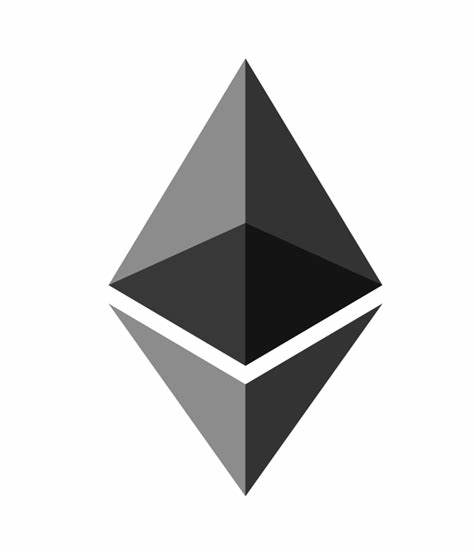</img>

## Clients

以太坊客户端：**遵循以太坊规范的程序**

以太坊规范：规定了以太坊网络和区块链的运作方式

> 黄皮书：https://ethereum.github.io/yellowpaper/paper.pdf

可以由各种编程语言实现，运行在各种操作系统上，一些常用客户端如下

| Client                                                       | Language | Operating systems     | Networks                                   |
| :----------------------------------------------------------- | :------- | :-------------------- | :----------------------------------------- |
| [Geth](https://geth.ethereum.org/)                           | Go       | Linux, Windows, macOS | Mainnet, Görli, Rinkeby, Ropsten           |
| [OpenEthereum](https://github.com/openethereum/openethereum) | Rust     | Linux, Windows, macOS | Mainnet, Kovan, Ropsten, and more          |
| [Nethermind](http://nethermind.io/)                          | C#, .NET | Linux, Windows, macOS | Mainnet, Görli, Ropsten, Rinkeby, and more |
| [Besu](https://pegasys.tech/solutions/hyperledger-besu/)     | Java     | Linux, Windows, macOS | Mainnet, Rinkeby, Ropsten, and Görli       |
| [Erigon](https://github.com/ledgerwatch/erigon)              | Go       | Linux, Windows, macOS | Mainnet, Görli, Rinkeby, Ropsten           |

站在这个角度看：**Ethereum is a protocol**


## P2P Network

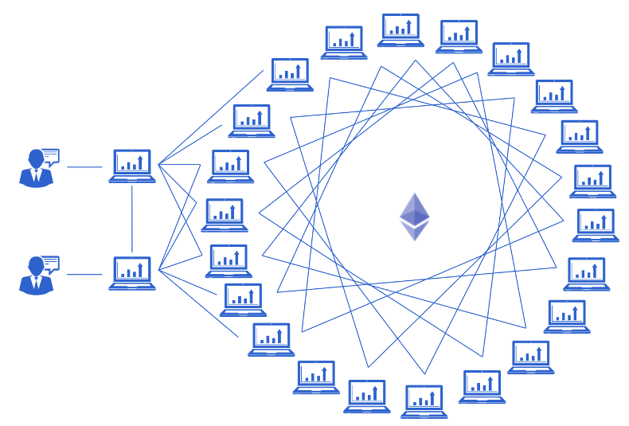

有许多的网络，公共的、私有的。它们之间相互独立运行，互不影响

公共网络：世界上任何拥有互联网连接的人都可以访问

+ Mainnet：以太坊主网，人们讨论的以太币就在这个网络上。https://etherscan.io/nodetracker
+ Testnet**s**：用于测试的网，以太坊开发者或智能合约的开发者，在把代码部署在主网之前会先放在测试网上测试一下，这个网上的以太币不要钱
+ Görli
+ Kovan
+ .... ....

私有网络：运行在私有网络比如企业内部，或者我们在开发的时候，创建一个本地的区块链实例来测试

+ Ganache：https://www.trufflesuite.com/ganache
+ Truffle：https://trufflesuite.com/docs/truffle/overview


> 亿些细节
>
> 1. 一个刚启动的客户端是如何发现其它节点，并且连接到主网的？
> 2. 节点之间是如何进行消息传递的？
>
> 深入了解
>
> 1. 什么是 P2P 协议？
> 2. 以太坊客户端实现了一个什么样的 P2P 过程，具体是怎么实现的？
>
> 一些可能有用的链接
>
> + https://medium.com/shyft-network-media/understanding-ethereums-p2p-network-86eeaa3345
>
> + https://medium.com/orbs-network/the-actual-networking-behind-the-ethereum-network-how-it-works-6e147ca36b45


## State Machine

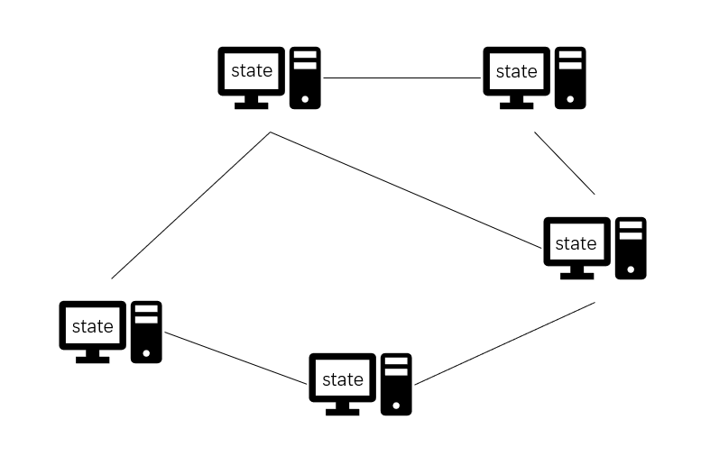

State：全局的单例，里面存有一些信息，例如账户余额

Transaction**s**：交易，交易会导致状态的更改


站在这个角度看：**Ethereum is a state machine**


一些名词

Block：包含一组已验证的交易


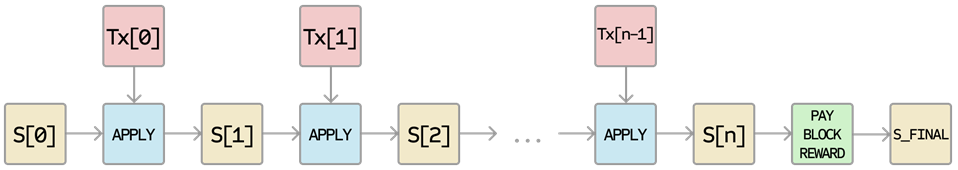


BlockChain：一组已确认的 Block

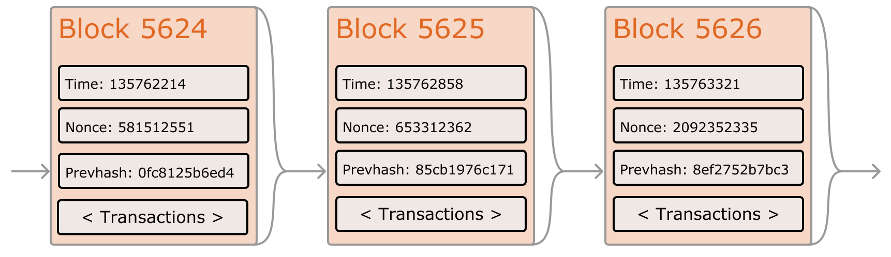


> 亿些细节
>
> 1. Block 内部包含哪些字段，如何判断一个 Block 是否合法？
> 2. 区块链分叉怎么解决？
> 3. 区块链和状态在本地是怎么保存的？
>
> 深入了解
>
> 1. **Merkle-Patricia tree** (**MPT**)
> 2. Level DB
>
> 一些可能有用的链接
>
> + https://github.com/ethereum/ethereum-org-website/blob/dev/src/content/whitepaper/index.md


## Transaction

生命周期 **上动画**

包含的字段：

+ Nonce：A sequence number, issued by the originating EOA, used to prevent message replay
+ Gas price：The price of gas (in wei) the originator is willing to pay
+ Gas limit：The maximum amount of gas the originator is willing to buy for this transaction
+ Recipient：The destination Ethereum address
+ Value：The amount of ether to send to the destination
+ Data：The variable-length binary data payload
+ v,r,s：The three components of an ECDSA digital signature of the originating EOA

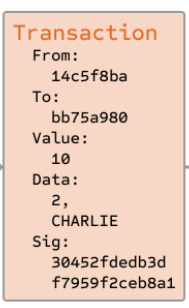

> 亿些细节
>
> 1. 如何验证一笔交易是合法的？
> 2. 以太坊钱包是如何生成和管理密钥的？
> 3. 交易字段中有 ”接收方“ 和 ”交易金额“ ，为什么没有 ”发送方“？
> 4. Nonce 字段有什么用，由谁生成、又由谁来验证？
>
> 深入了解
>
> 1. 什么是分层钱包技术
> 2. 非对称加密
> 3. ECDSA 签名算法的原理
>
> 一些可能有用的链接
>
> + https://github.com/bitcoin/bips/blob/master/bip-0032.mediawiki
> + https://learning.oreilly.com/library/view/mastering-ethereum/9781491971932/ch06.html


## Smart Contract

如果把以太坊网络比作一个公有云服务，Smart Contract 就是部署在这个云服务上的后台


```solidity
1 // Version of Solidity compiler this program was written for
2 pragma solidity ^0.4.19;
3 
4 // Our first contract is a faucet!
5 contract Faucet {
6 
7     // Give out ether to anyone who asks
8     function withdraw(uint withdraw_amount) public {
9 
10         // Limit withdrawal amount
11         require(withdraw_amount <= 100000000000000000);
12 
13         // Send the amount to the address that requested it
14         msg.sender.transfer(withdraw_amount);
15     }
16 
17     // Accept any incoming amount
18     function () public payable {}
19 
20 }
```


我们可以通过 HTTP 请求来调用某个 API，传递指定的参数来获取相应的返回

类似的我们也可以通过 Web3.js 来调用某个智能合约的函数，传递参数并获取返回值

一个 API 有自己的 host，一个智能合约也有自己的 address


智能合约的部署

1. 用合适的语言编写智能合约代码（Solidity、Vyper，等高级语言）
2. 编译成字节码
3. 生成一个 Transaction，将字节码放入交易的 data 字段
4. 这个交易被广播出去、被矿工添加到块里，最后同步到网络中的所有节点上【这段字节码是会上链的，即不可篡改】


智能合约函数的调用

1. 确定好调用哪个合约【合约地址】
2. 确定好要调用的【函数名】和传递的【参数】
3. 用以上信息构造一个 Transaction，将其广播，被矿工添加到块里
4. 接收到这个交易后，根据【合约地址】字段把对应的合约代码加载出来
5. 根据【函数名】找到函数，并把【参数】传进去交由**以太坊虚拟机**去执行


以太坊状态转换如下：

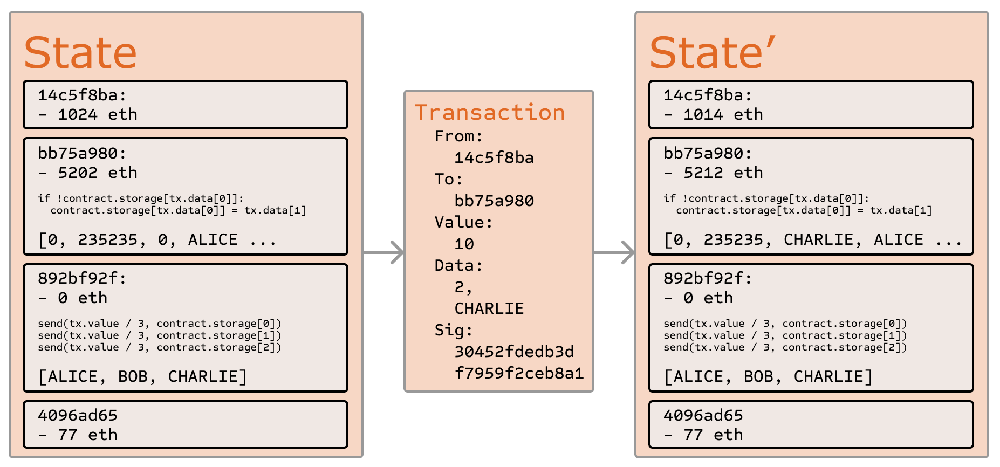


>亿些细节
>
>1. 智能合约的代码码是如何执行的？
>2. 是否每个智能合约的函数调用都会改变 State？
>3. 智能合约函数是如何把值返回出来的？
>4. 什么是图灵完备？
>
>深入了解
>
>1. EVM 以太坊虚拟机
>2. 什么是智能合约执行的上下文环境
>3. Solidity + Remix IDE
>
>一些可能有用的链接
>
>+ https://ethereum.org/en/developers/docs/smart-contracts/
>+ https://docs.soliditylang.org/en/v0.8.9/
>+ https://remix.ethereum.org/


## Decentralized Applications

简称 DApps，以 智能合约为 后台的应用就是 DApp

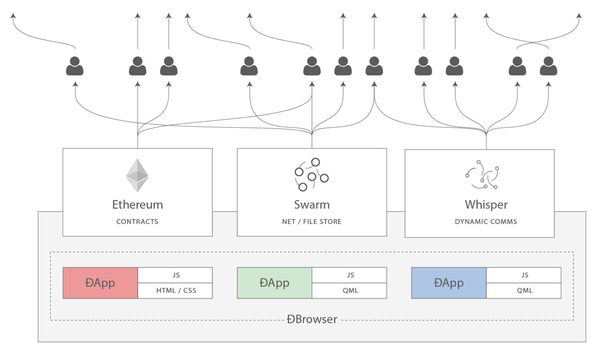

提供了基于区块链的**存储**和各参与节点的**运算**

存储 + 运算 = 计算机

站在这个角度看：**Ethereum is a world computer**

任何人都可以使用这个世界计算机，可以发布自己的应用，给钱（ETH）就行

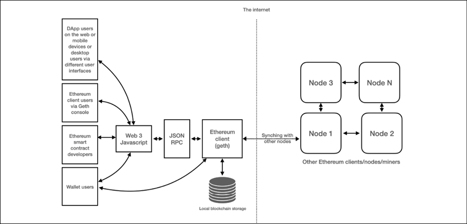

> 可以去了解
>
> 1. Oracle，预言机
> 2. NFT
> 3. Decentralized File Storage，去中心化文件存储（IPFS、Swarm）
> 4. Tokens，基于以太坊智能合约的一些代币协议
>
> 一些可能有用的链接
>
> + https://www.theverge.com/22310188/nft-explainer-what-is-blockchain-crypto-art-faq
> + https://ethereum.org/en/developers/docs/oracles/
> + https://github.com/ipfs/ipfs


## 长这样

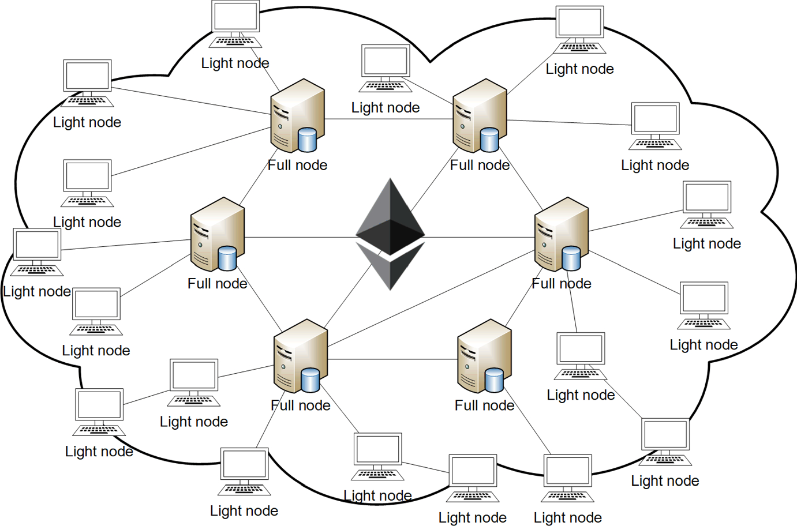

Node 类型：

- Full nodes：Receive copies of transactions. Has the current state of the blockchain. Store the **state of the most recent 128 blocks** (or only 64 if you’re using fast/snap sync) and about one week of trace data updated as soon as the new block comes in.

- Light nodes：Doesn’t have the entirety of the current blockchain state and **depends on a full node**. It gets the parts it cares about from someone it trusts. useful for low memory and computational devices. 

- Archive nodes：Has data since genesis block.

- Miner nodes：Miner nodes verify transactions and add them to the blocks. They then mine those blocks and secure the blockchain with proof of work. 

    **To be a miner you need to run a full node**, and also run a mining package. 


## 矿池

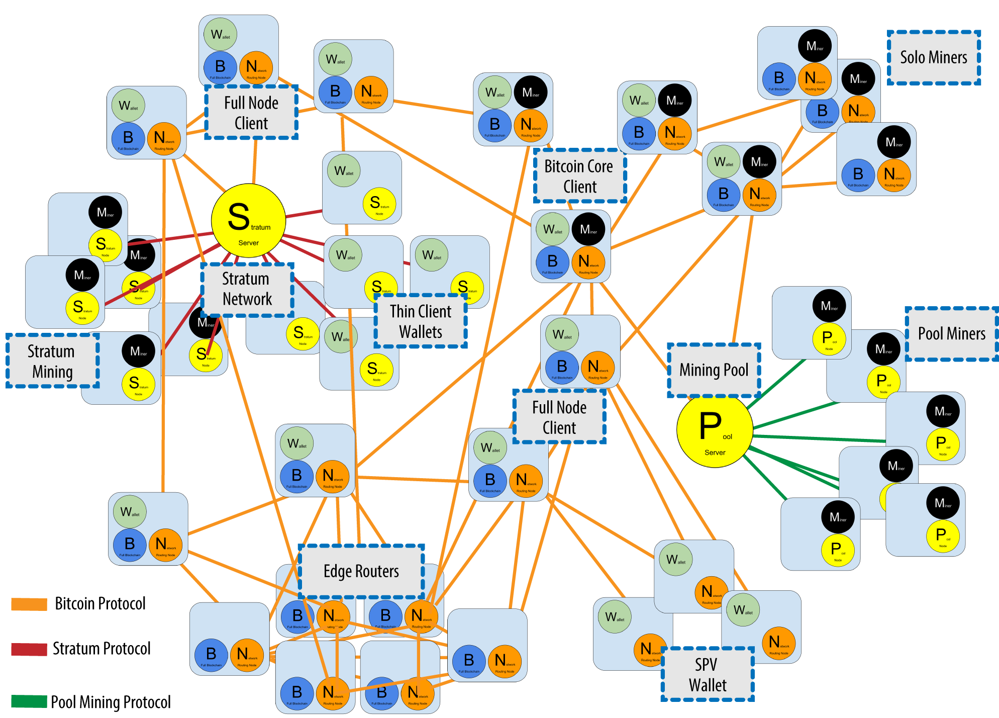


矿池中心提供一个全节点，所有加入矿池的矿工共用这个全节点，运行私有的矿池协议

> 亿些细节：
>
> 1. 矿池是如何分配收益给矿工的？
> 2. 什么是 Hash Rate （哈希率）？
>
> 一些可能有用的链接：
>
> + https://www.investopedia.com/tech/how-do-mining-pools-work/


# Ethereum 2.0 


很多原因：

+ 提升出块速度
+ 节约能源
+ 增加可扩展性
+ ...


## Proof of Stake

权益证明是一种用于激励验证者接受更多质押的基本机制。 

就以太币而言，用户需要质押 32ETH 来获得作为验证者的资格。 

验证者被随机选择去创建区块，并且负责检查和确认那些不是由他们创造的区块。

如果验证者合作不积极或拒绝合作，就会没收验证者资格甚至损失全部质押


以太坊 2.0 使用的 POS 协议是：Casper-FFG

为了提供从旧共识机制到新共识机制的平滑过渡，Casper FFG 模型将新的 PoS 协议覆盖在当前的 PoW 协议上


> 亿点细节：
>
> 1. 分叉问题怎么处理
>
> 深入了解
>
> 1. Casper: Ethereum’s Proof-of-Stake Algorithm
> 2. Zero Knowledge (ZK) snarks
>
> 一些可能有用的链接：
>
> + https://academy.binance.com/en/articles/ethereum-casper-explained
> + https://www.blockchain-council.org/blockchain/a-quick-guide-to-ethereum-casper/


## Sharding

区块链分片

将一条主链拆分成多个分链，每个分链作为一条区块链系统单独运行

每个分片链上的节点只需要负责维护一部分 State，验证的工作量减少，出块时间缩短

整体上看 64 个分片可以并行出块


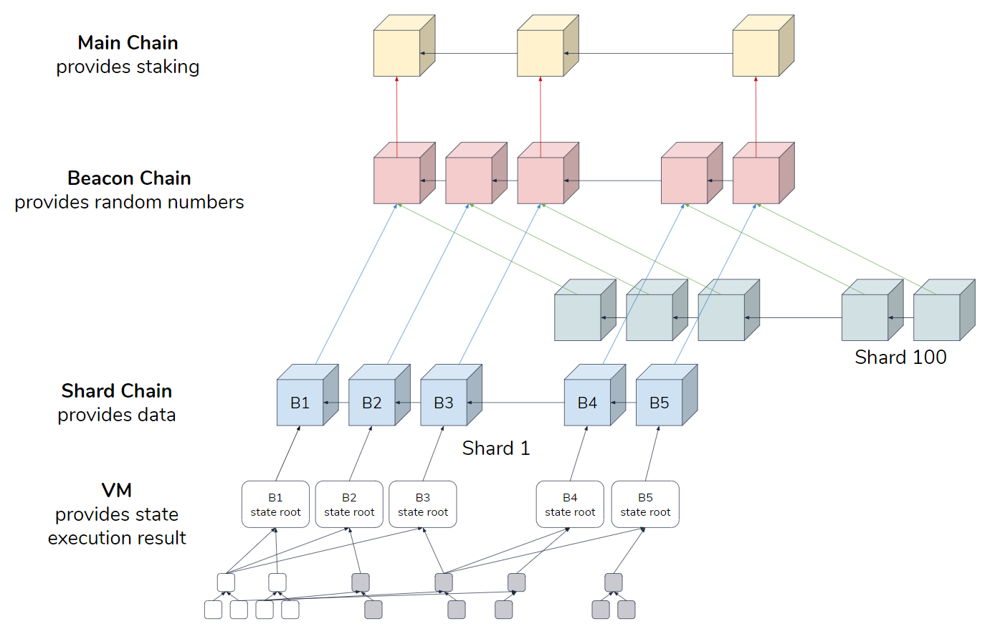

1. 分片链：Shard Chain
2. 信标链：Beacon Chain，协调整个POS机制以及分片链之间通信的桥梁
3. 验证节点：Validator nodes，由信标链随机分配验证分片链的节点


> 亿点细节：
>
> 1. 验证节点是如何被分派到不同的分片上的
> 1. 跨分片通信
> 1. 随机数的问题
>
> 一些可能有用的链接
>
> + https://learning.oreilly.com/library/view/mastering-blockchain/9781839213199/Text/Chapter_16.xhtml#_idParaDest-517
> + https://medium.com/nearprotocol/detailed-overview-of-ethereum-2-0-shard-chains-committees-proposers-and-attesters-a9992d2fd103
> + https://ethereum.org/zh/developers/docs/consensus-mechanisms/pos/


## Process from Eth1 to Eth2

升级的过程分三个阶段

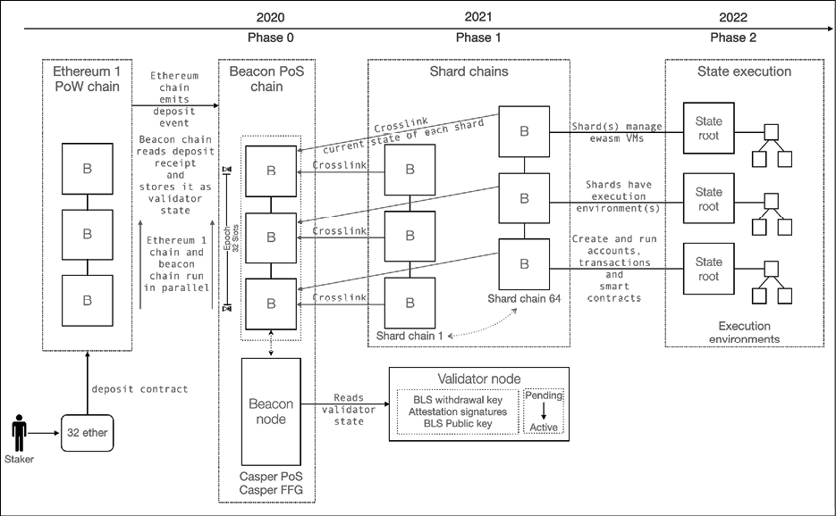

