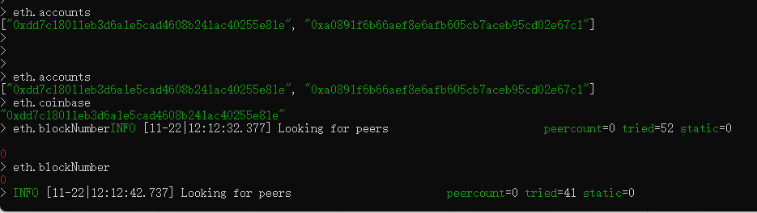
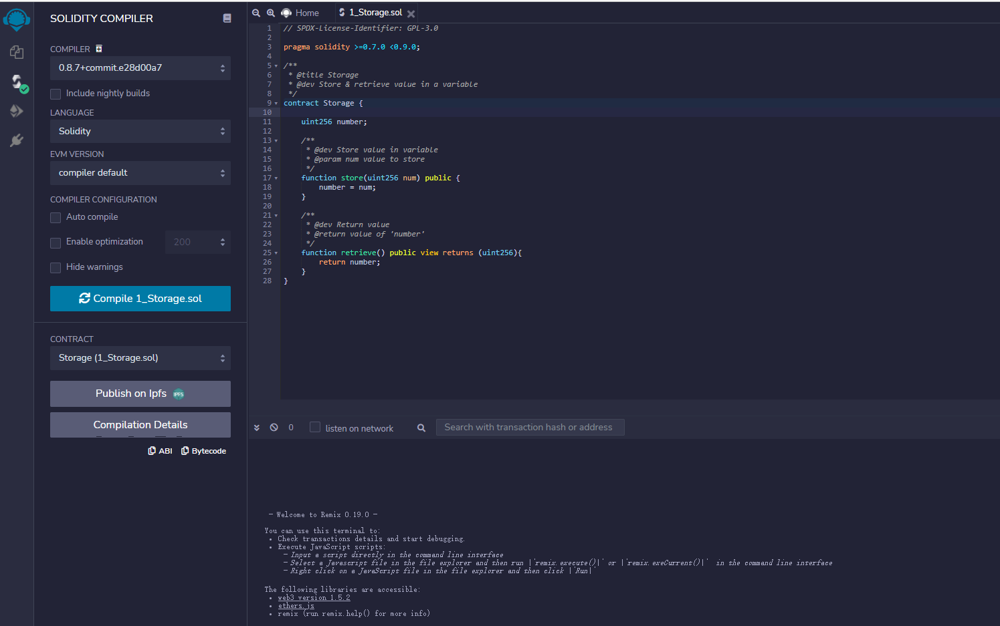
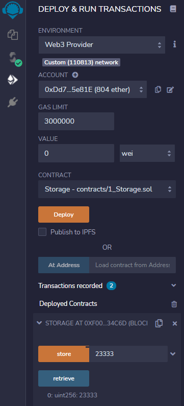

# 区块链开发——智能合约

Go-ethereum:

​	[ethereum/go-ethereum: Official Go implementation of the Ethereum protocol (github.com)](https://github.com/ethereum/go-ethereum)

Hyperledger Fabric:

[	hyperledger/fabric: Hyperledger Fabric is an enterprise-grade permissioned distributed ledger framework for developing solutions and applications. Its modular and versatile design satisfies a broad range of industry use cases. It offers a unique approach to consensus that enables performance at scale while preserving privacy. (github.com)](https://github.com/hyperledger/fabric)

Solidity:

​	[Solidity — Solidity 0.8.10 documentation (soliditylang.org)](https://docs.soliditylang.org/en/v0.8.10/)


[TOC]


## 智能合约

**智能合约**是一种计算机程序或交易协议，旨在根据共识的合同或协议的条款自动执行、控制或记录事件和行动。智能合约的目标是减少对可信中介的需求、审查和执行成本、欺诈损失，以及减少恶意攻击。**在区块链网络上使用加密签名交易部署的代码和数据(有时称为函数和状态)的集合。**

开发者通过智能合约去制定一套规则，然后发布到线上，人与智能合约进行交互，由机器去完成业务的部分，这样就规避了由人来做执行时可能造成的作弊行为。

## 以太坊

以太坊（Ethereum）是一个去中心化的开源的有**智能合约**功能的公共区块链平台。以太币（ETH 或 Ξ）是以太坊的原生加密货币。截止目前，以太币是市值第二高的加密货币，仅次于比特币。以太坊是使用最多的区块链，被称为“第二代的区块链平台”。以太坊相比比特币的一个重大创新就是它支持智能合约。

```
	Ethereum is a decentralized platform that runs smart contracts, applications that run exactly as programmed without possibility of downtime, censorship, fraud or third party interference.

	————https://geth.ethereum.org/
```

最常用的开发智能合约的语言是以太坊专门为其定制的Solidity语言，后续我们会详细介绍Solidity的用法。一段Solidity代码，可以被**编译后部署在以太坊**上（花费gas），部署时会根据分配一个**合约地址**，合约地址和账户地址的格式是没有区别的，但合约地址没有私钥，也就没有人能直接操作该地址的合约数据。要调用合约，唯一的方法是调用合约的公共函数。

以太坊提供了一个**EVM（Ethereum Virtual Machine）虚拟机**来执行智能合约的字节码，并且，和普通程序相比，为了消除程序运行的不确定性，智能合约有很多限制，例如，**不支持浮点运算**（因为浮点数有不同的表示方法，不同架构的CPU运行的浮点计算精度都不同），**不支持随机数**，**不支持从外部读取输入**等等。并且合约**不能主动执行**，它只能被外部账户发起调用。如果一个合约要定期执行，那只能由线下服务器定期发起合约调用。

合约在执行的过程中，**可以调用其他已部署的合约**，前提是知道其他合约的地址和函数签名，这就大大扩展了合约的功能。例如，一个合约可以调用另一个借贷合约的借款方法，再调用交易合约，最后再调用还款方法，实现完整功能。多个合约的嵌套调用也使得因为代码编写的漏洞导致黑客攻击的可能性大大增加。为了避免漏洞，编写合约时需要更加小心。

## Solidity

Solidity是一种面向对象的高级语言，用于实现智能合约，控制以太坊账户行为。Solidity受C++、Python和JavaScript的影响，旨在应用于以太坊虚拟机(EVM)。通过Solidity，您可以创建用于投票、众筹、拍卖和多重签名钱包等用途的合同。

### 数据存储

```
// SPDX-License-Identifier: GPL-3.0
// the GPL version 3.0. Machine-readable license
pragma solidity >=0.4.16 <0.9.0;

contract Storage {

    uint256 number;

    /**
     * @dev Store value in variable
     * @param num value to store
     */
    function store(uint256 num) public {
        number = num;
    }

    /**
     * @dev Return value 
     * @return value of 'number'
     */
    function retrieve() public view returns (uint256){
        return number;
    }
}
```


### 子货币

```
// SPDX-License-Identifier: GPL-3.0
pragma solidity ^0.8.4;

contract Coin {
    // The keyword "public" makes variables
    // accessible from other contracts
    address public minter;
    mapping (address => uint) public balances;

    // Events allow clients to react to specific
    // contract changes you declare
    event Sent(address from, address to, uint amount);

    // Constructor code is only run when the contract
    // is created
    constructor() {
        minter = msg.sender;
    }

    // Sends an amount of newly created coins to an address
    // Can only be called by the contract creator
    function mint(address receiver, uint amount) public {
        require(msg.sender == minter);
        balances[receiver] += amount;
    }

    // Errors allow you to provide information about
    // why an operation failed. They are returned
    // to the caller of the function.
    error InsufficientBalance(uint requested, uint available);

    // Sends an amount of existing coins
    // from any caller to an address
    function send(address receiver, uint amount) public {
        if (amount > balances[msg.sender])
            revert InsufficientBalance({
                requested: amount,
                available: balances[msg.sender]
            });

        balances[msg.sender] -= amount;
        balances[receiver] += amount;
        emit Sent(msg.sender, receiver, amount);
    }
}
```


## 搭建私链

在以太坊的共有链上部署智能合约、发起交易需要花费以太币。而通过修改配置，可以在本机搭建一套以太坊私有链，因为与公有链没关系，既**不用同步公有链庞大的数据**，也**不用购买以太币**，很好地满足了智能合约**开发和测试的要求**，开发好的智能合约也可以很**容易切换接口**部署到以太坊公有链上。

### Go-ethereum

[ethereum/go-ethereum: Official Go implementation of the Ethereum protocol (github.com)](https://github.com/ethereum/go-ethereum)

The go-ethereum project comes with several wrappers/executables found in the `cmd` directory.

| Command    | Description                                                  |
| ---------- | ------------------------------------------------------------ |
| **`geth`** | Our main Ethereum CLI client. It is the entry point into the Ethereum network (main-, test- or private net), capable of running as a full node (default), archive node (retaining all historical state) or a light node (retrieving data live). It can be used by other processes as a gateway into the Ethereum network via JSON RPC endpoints exposed on top of HTTP, WebSocket and/or IPC transports. `geth --help` and the [CLI page](https://geth.ethereum.org/docs/interface/command-line-options) for command line options. |
| `clef`     | Stand-alone signing tool, which can be used as a backend signer for `geth`. |
| `devp2p`   | Utilities to interact with nodes on the networking layer, without running a full blockchain. |
| `abigen`   | Source code generator to convert Ethereum contract definitions into easy to use, compile-time type-safe Go packages. It operates on plain [Ethereum contract ABIs](https://docs.soliditylang.org/en/develop/abi-spec.html) with expanded functionality if the contract bytecode is also available. However, it also accepts Solidity source files, making development much more streamlined. Please see our [Native DApps](https://geth.ethereum.org/docs/dapp/native-bindings) page for details. |
| `bootnode` | Stripped down version of our Ethereum client implementation that only takes part in the network node discovery protocol, but does not run any of the higher level application protocols. It can be used as a lightweight bootstrap node to aid in finding peers in private networks. |
| `evm`      | Developer utility version of the EVM (Ethereum Virtual Machine) that is capable of running bytecode snippets within a configurable environment and execution mode. Its purpose is to allow isolated, fine-grained debugging of EVM opcodes (e.g. `evm --code 60ff60ff --debug run`). |
| `rlpdump`  | Developer utility tool to convert binary RLP ([Recursive Length Prefix](https://eth.wiki/en/fundamentals/rlp)) dumps (data encoding used by the Ethereum protocol both network as well as consensus wise) to user-friendlier hierarchical representation (e.g. `rlpdump --hex CE0183FFFFFFC4C304050583616263`). |
| `puppeth`  | a CLI wizard that aids in creating a new Ethereum network.   |


### 配置创世块

Genesis.json：

```"config": {
{
  "config": {
    "chainId": 6667781,
    "homesteadBlock": 0,
    "eip150Block": 0,
    "eip150Hash": "0x0000000000000000000000000000000000000000000000000000000000000000",
    "eip155Block": 0,
    "eip158Block": 0,
    "byzantiumBlock": 0,
    "constantinopleBlock": 0,
    "petersburgBlock": 0,
    "istanbulBlock": 0,
    "ethash": {}
  },
  "nonce": "0x0",
  "timestamp": "0x5ddf8f3e",
  "extraData": "0x0000000000000000000000000000000000000000000000000000000000000000",
  "gasLimit": "0x47b760",
  "difficulty": "0x00002",
  "mixHash": "0x0000000000000000000000000000000000000000000000000000000000000000",
  "coinbase": "0x0000000000000000000000000000000000000000",
  "alloc": { },
  "number": "0x0",
  "gasUsed": "0x0",
  "parentHash": "0x0000000000000000000000000000000000000000000000000000000000000000"
}
```


```shell
geth --datadir=$datadir init Genesis.json
```


### 创建账户&启动私链

```shell
geth --datadir $datadir account new
geth -networkid 110813 -datadir $datadir -port 5555 -http -http.api net,eth,web3,personal -http.port 8545 --http --http.corsdomain "*" --allow-insecure-unlock console
```
| Command                                    	               | Meaning                                                      |
| ------------------------------------------------------------ | ------------------------------------------------------------ |
| personal.newAccount()                                        | 创建账户                                                     |
| personal.listAccounts                                        | 查看账户，同eth.accounts                                     |
| personal.unlockAccount(eth.accounts[0])                      | 解锁账户                                                     |
| eth.accounts                                                 | 枚举系统中的账户                                             |
| eth.getBalance(eth.accounts[0])                              | 查看账户余额，返回值的单位是 Wei（Wei 是以太坊中最小货币面额单位，类似比特币中的聪，1 ether = 10^18 Wei） |
| miner.setEtherbase(eth.accounts[1])                          | 将账户1设置成coinbase                                        |
| eth.blockNumber                                              | 列出区块总数                                                 |
| eth.getBlock()                                               | 获取区块                                                     |
| miner.start()                                                | 开始挖矿                                                     |
| miner.stop()                                                 | 停止挖矿                                                     |
| eth.coinbase                                                 | 挖矿奖励的账户                                               |
| web3.fromWei(eth.getBalance(eth.accounts[0]),‘ether’)        | Wei 换算成以太币                                             |
| amount = web3.toWei(5,‘ether’)                               | 以太币换算成 Wei                                             |
| eth.sendTransaction({from:eth.accounts[0],to:eth.accounts[1],value:amount}) | 发起交易                                                     |
| txpool.status                                                | 交易池中的状态                                               |
| eth.getTransaction()                                         | 获取交易                                                     |
| admin.addPeer()                                              | 连接到其他节点                                               |
| admin.nodeInfo                                               | 查看节点摘要信息                                             |





## 部署合约

启动私链，并开始挖矿。

> miner.start()


### 部署方式

 [【区块链】以太坊 web3j for java 使用 - 部署和调用合约 <3>_Linoy-CSDN博客](https://blog.csdn.net/loy_184548/article/details/78668180?utm_medium=distribute.pc_relevant.none-task-blog-2~default~baidujs_title~default-0.essearch_pc_relevant&spm=1001.2101.3001.4242.1)

[智能合约solidity项目部署流程 - 简书 (jianshu.com)](https://www.jianshu.com/p/1320d5a1e775)

### Remix部署

#### Remix界面



#### 连接私链

选择Web3 Provider方式，通过http://127.0.0.1:8545连接到本地私链。


#### 部署到私链

部署到本地私链。获得合约地址：0xf0001d94D8348BE377776c2964289c6cFa634C6d；



## 调用合约

基本步骤：

1. web3连接到私链；
2. 根据合约地址调用合约；
3. 私链挖矿执行合约。
